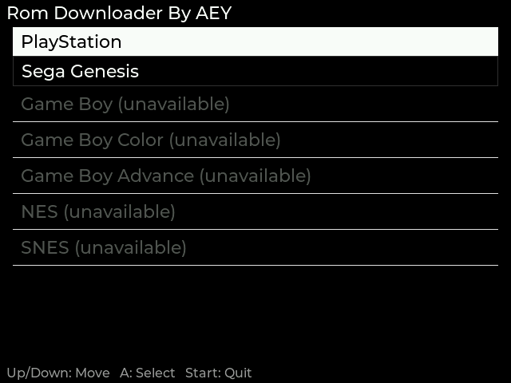

# rom-downloader

A little native GUI app that brings ROM browsing and downloading straight
onto your Onion OS handheld (Miyoo Mini Plus) — no more swapping SD cards
just to grab one game. Pick a system, search, hit download, and it's ready
to play by the time you back out of the menu.

## Screenshots

| System select | ROM list + box art |
|---|---|
|  |  |

## Installation

1. Download `rom-downloader-<version>.zip` from the
   [Releases](https://github.com/nullRefErr/rom-downloader/releases) page.
2. Extract it onto your SD card's root — it contains an `App/RomDownloader/`
   folder that merges into your existing `App/` folder (same layout Onion
   itself uses for every app).
3. Reboot the device (or rescan Apps), then launch **Rom Downloader By AEY**
   from the Apps menu.
4. Pick a system (PlayStation, Genesis, Game Boy, Game Boy Color, Game Boy
   Advance, NES, SNES — any grayed out means that system's archive.org
   source is temporarily down), browse or press Y to search, press A on a
   rom to confirm and download. It lands directly in `Roms/<system>/` and
   shows up in the emulator's game list without a manual rescan.

The app checks for updates on startup and offers to install new versions
in place — see the [Changelog](CHANGELOG.md) for what's changed.

## Contributing

Found a bug, have an idea, or just want to poke around? Contributions are
very welcome:

- **Bugs / ideas**: open an [issue](https://github.com/nullRefErr/rom-downloader/issues) — screenshots and `log.txt`/`crash.txt` from the device help a lot.
- **Code**: fork, branch, and open a PR. This is native C (SDL2 + LVGL) cross-compiled for the Miyoo Mini Plus — if you've got the device and Docker for the toolchain, you can build and test the whole thing yourself.
- Small fixes, new systems, UI polish, whatever scratches your itch — all appreciated.
