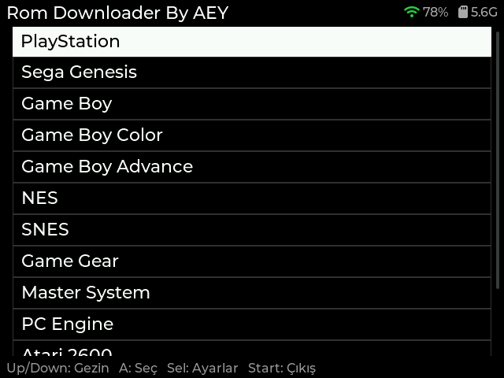
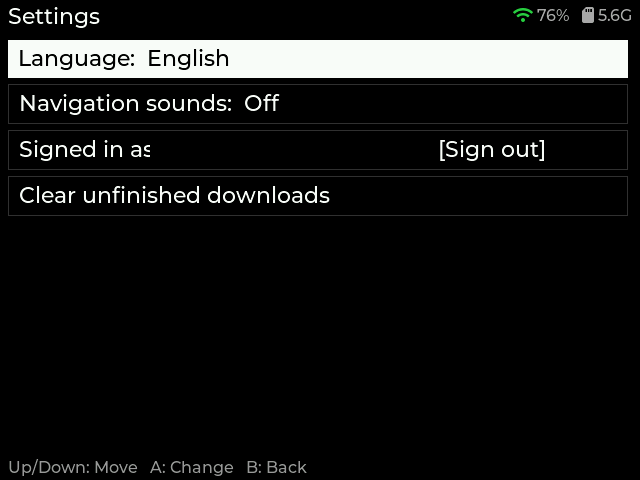

# rom-downloader

A little native GUI app that brings ROM browsing and downloading straight
onto your Onion OS handheld (Miyoo Mini Plus) — no more swapping SD cards
just to grab one game. Pick a system, search, hit download, and it's ready
to play by the time you back out of the menu.

## Screenshots

| Systems | ROM list + box art |
|---|---|
|  |  |

## Features

- **12 systems** — PlayStation, Genesis, Game Boy, Game Boy Color, Game Boy
  Advance, NES, SNES, Game Gear, Master System, PC Engine, Atari 2600 and
  Atari 7800, plus Nintendo DS. Downloads land in `Roms/<system>/` and show
  up in the emulator's own game list without a manual rescan.
- **Search and filters** — search by name (Y), filter by region, or show only
  your favourites. Mark a rom with X to favourite it.
- **Box art** while you browse, cached on the card so it only downloads once.
- **Download queue** — line several roms up and they download one after
  another in the background, even if you leave the list.
- **Resume** — an interrupted download continues where it stopped rather
  than starting over.
- **Five languages** — English, Deutsch, Français, 日本語, Türkçe. Switching
  applies immediately, no restart.
- **Navigation sounds**, which you can turn off.
- **Wi-Fi and free-space indicators** in the header.
- **Updates itself** — new versions are offered on startup.

### Settings

Press **Select** on the system list. Language, sounds, your archive.org
account and a button to clear unfinished downloads. Everything is remembered
across restarts.

Translations live in `lang.json` next to the app, so wording can be fixed —
or a language added — by editing that file, no rebuild needed.

### archive.org sign-in

Some sources (PlayStation, currently) are only served to logged-in accounts;
anonymous downloads from them fail. The app says so plainly and offers to
sign in with **your own** account, from the device.

Optionally you can leave credentials in a `.env` file so the session renews
itself without retyping — but note it stores your password in plain text on
the card, which has no file permissions. `archive_cookies.txt.example`
describes the cookie-only route instead, which stores nothing you can't
revoke by logging out, and also works for accounts with two-step
verification. Both example files ship with the app.

## Controls

| | System list | ROM list |
|---|---|---|
| **A** | Select | Download |
| **B** | — | Back / clear filters |
| **X** | — | Favourite |
| **Y** | — | Search |
| **Select** | Settings | Filters |
| **Start** | Quit | Quit |

Hold a direction to scroll continuously.

## Installation

1. Download `rom-downloader-<version>.zip` from the
   [Releases](https://github.com/nullRefErr/rom-downloader/releases) page.
2. Extract it onto your SD card's root — it contains an `App/RomDownloader/`
   folder that merges into your existing `App/` folder (same layout Onion
   itself uses for every app).
3. Reboot the device (or rescan Apps), then launch **Rom Downloader By AEY**
   from the Apps menu.

Already have it installed? The app offers each new version on startup — press
A and it updates itself. See the [Changelog](CHANGELOG.md) for what's changed.

A system shown greyed out means that system's archive.org source is
unavailable; these do come and go, and the app re-checks each time.

## Contributing

Found a bug, have an idea, or just want to poke around? Contributions are
very welcome:

- **Bugs / ideas**: open an [issue](https://github.com/nullRefErr/rom-downloader/issues) — screenshots and `log.txt`/`crash.txt` from the device help a lot. Downloads record why they failed in `log.txt`, which is usually the fastest way to a diagnosis.
- **Translations**: `lang.json` is plain data — correcting a phrase or adding a language is an edit, not a build. New characters may need the UI fonts regenerated; `third_party/fonts/README.md` explains how.
- **Code**: fork, branch, and open a PR. This is native C (SDL2 + LVGL) cross-compiled for the Miyoo Mini Plus — if you've got the device and Docker for the toolchain, you can build and test the whole thing yourself.
- Small fixes, new systems, UI polish, whatever scratches your itch — all appreciated.
