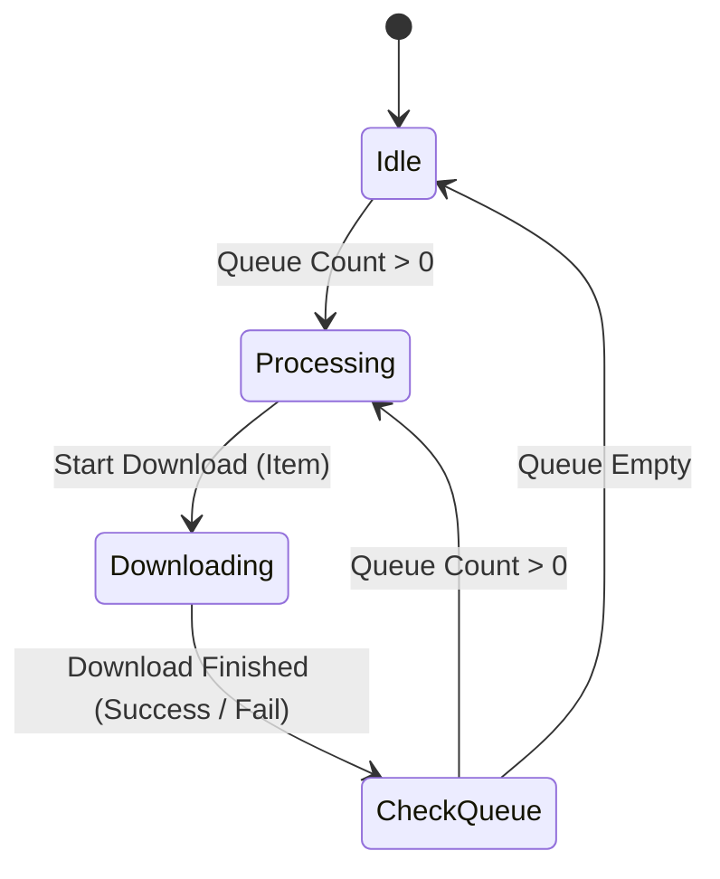

# rom-downloader: Roadmap Features Specification

This specification documents the technical architecture, data structures, UI mockups, and low-level C implementation strategies for the 6 proposed enhancement features for `rom-downloader` on Miyoo Mini Plus (Onion OS).

---

## 1. Disk Space Indicator (Depolama Göstergesi)

### Objective
Provide real-time visibility into the remaining free space of the SD card (`/mnt/SDCARD`) so that users can avoid starting large downloads (especially PSX `.chd` files) that exceed available space.

### C Implementation (`src/storage.c`)
Standard POSIX `<sys/statvfs.h>` will be used to query filesystem statistics.

```c
#include <sys/statvfs.h>
#include <stdbool.h>

typedef struct {
    unsigned long long total_bytes;
    unsigned long long free_bytes;
    double free_percent;
} StorageInfo;

StorageInfo storage_get_free_space(const char *path) {
    StorageInfo info = {0};
    struct statvfs vfs;
    if (statvfs(path, &vfs) == 0) {
        info.total_bytes = (unsigned long long)vfs.f_blocks * vfs.f_frsize;
        info.free_bytes = (unsigned long long)vfs.f_bavail * vfs.f_frsize; // Available blocks to non-superuser
        info.free_percent = ((double)info.free_bytes / info.total_bytes) * 100.0;
    }
    return info;
}
```

### UI Integration
- Displayed as a small footer label or sub-header on `ui_emu_select` and `ui_rom_list`.
- **Text Format**: `Free: 12.45 GB (45%)`
- Updated dynamically on entry and immediately after a download completes.

---

## 2. Download Resume (Kaldığı Yerden Devam Etme)

### Objective
If a download fails or is interrupted due to a Wi-Fi dropout, the app should resume the download from where it left off instead of redownloading the entire file.

### C Implementation (`src/download.c`)
Modify the execution command of `wget` in [download.c](file:///Users/eren/projects/rom-downloader/src/download.c#L79-L81) to include the `-c` (continue) parameter.

```diff
-    snprintf(cmd, sizeof(cmd),
-             "(wget -q -O '%s' '%s' && touch '%s') || touch '%s' &",
-             g_part_path, url, g_done_marker, g_failed_marker);
+    snprintf(cmd, sizeof(cmd),
+             "(wget -q -c -O '%s' '%s' && touch '%s') || touch '%s' &",
+             g_part_path, url, g_done_marker, g_failed_marker);
```

### Mechanics
1. **No Clean**: Remove `remove(g_part_path);` from [download.c](file:///Users/eren/projects/rom-downloader/src/download.c#L67) if the user is resuming an active file.
2. **Progress Calculation**: `download_poll()` calculates progress based on the current file size on disk relative to the expected size.
   - If the file is 50MB of 100MB, `download_poll()` starts showing `50%` immediately and increments up to `100%`.

---

## 3. Download Queue (İndirme Kuyruğu)

### Objective
Allow users to select multiple ROMs and add them to a background queue, rather than locking the UI or forcing the user to wait for one download to finish.

### C Implementation (`src/download_queue.h`)
```c
#ifndef DOWNLOAD_QUEUE_H
#define DOWNLOAD_QUEUE_H

#define MAX_QUEUE_SIZE 16

typedef struct {
    char archive_id[64];
    char item_path[256];
    char dest_dir[128];
    char dest_filename[128];
    unsigned long size;
} QueueItem;

typedef struct {
    QueueItem items[MAX_QUEUE_SIZE];
    int head;
    int tail;
    int count;
} DownloadQueue;

void queue_init(void);
bool queue_push(QueueItem item);
bool queue_pop(QueueItem *out_item);
void queue_tick(void);

#endif
```

### Flow Control


---

## 4. Region & Hack ROM Filtering (Bölge ve Dil Filtreleme)

### Objective
Filter ROM lists based on region codes `(USA)`, `(Europe)`, `(Japan)` or modification indicators like `[T-Tur]`, `[T-En]`, `[Hack]`.

### Regex / Substring Logic (`src/filter.c`)
Using No-Intro standard naming conventions:
- **Europe**: contains `(Europe)` or `(Europe,` or `(EU)`
- **USA**: contains `(USA)` or `(USA,`
- **Japan**: contains `(Japan)` or `(Japan,`
- **Turkish Trans**: contains `[T-Tur]` or `[T-TR]` or `(Turkey)` or `(Turkish)`

```c
typedef enum {
    REGION_ALL,
    REGION_USA,
    REGION_EUROPE,
    REGION_JAPAN,
    FILTER_HACKS,
    FILTER_TURKISH
} FilterType;

bool filter_matches(const char *filename, FilterType filter) {
    switch (filter) {
        case REGION_USA:
            return strstr(filename, "(USA") != NULL;
        case REGION_EUROPE:
            return strstr(filename, "(Europe") != NULL || strstr(filename, "(EU") != NULL;
        case REGION_JAPAN:
            return strstr(filename, "(Japan") != NULL;
        case FILTER_TURKISH:
            return strstr(filename, "[T-Tur") != NULL || strstr(filename, "(Tur") != NULL;
        default:
            return true;
    }
}
```

### UI Presentation
- Triggered by pressing `X` on the `ui_rom_list` screen.
- Opens an overlay dropdown or simple prompt selection:
  `Region: [All] | USA | Europe | Japan | Turkish`

---

## 5. Favorites List (Favoriler Listesi)

### Objective
Mark specific titles with a star indicator to create a custom subset of games that are instantly accessible across restarts.

### C Implementation (`src/favorites.c`)
- **Storage**: Saved as a flat newline-separated text file of game names `/mnt/SDCARD/App/RomDownloader/favorites_<emu_code>.txt`.
- **UI Interaction**:
  - Pressing `X` (or designated key) toggles the favorite status of the selected ROM.
  - An icon (e.g., star `★` or symbol) is drawn next to favorited rows.
  - Pressing `Y` (Search) options can include a toggle: `"Show Favorites Only"`.

---

## 6. Wi-Fi Status Indicator (Wi-Fi Sinyal Göstergesi)

### Objective
Display a status icon showing the current connection strength directly within the LVGL UI.

### C Implementation (`src/wifi.c`)
Read connection data from Linux pseudofiles:
- `/sys/class/net/wlan0/carrier` (1 = connected, 0 = disconnected).
- `/proc/net/wireless` (contains link quality metric).

```c
#include <stdio.h>

int wifi_get_signal_strength(void) {
    FILE *f = fopen("/proc/net/wireless", "r");
    if (!f) return -1; // Wi-Fi inactive or driver not exposing stats
    
    char line[256];
    int strength = -1;
    // Skip first two header lines
    fgets(line, sizeof(line), f);
    fgets(line, sizeof(line), f);
    if (fgets(line, sizeof(line), f)) {
        // Parse link quality value (usually column 3)
        int link;
        if (sscanf(line, "%*s %*d %d", &link) == 1) {
            strength = link; // Typically 0 to 70
        }
    }
    fclose(f);
    return strength;
}
```

### UI Presentation
- Map signal value ranges (`strength`) to a matching unicode character or small symbol in the top-right header:
  - `📶` (Strong Signal)
  - `⇿` / `!` (No connection)
