# rom-downloader: Self-Updater Specification

This specification outlines the architecture, data flow, and user interface for integrating a self-update mechanism directly into the native C application running on the Miyoo Mini Plus (Onion OS).

---

## 1. Objectives

1. **Check for Updates**: Check the GitHub Releases API for new versions in the background on app startup.
2. **User Notification**: Prompt the user with a clean, high-contrast LVGL modal when a new update is found.
3. **Seamless In-Place Upgrade**: Download the update directly on the device, swap the executable, and restart the app without requiring manual SD card manipulation or PC file copying.

---

## 2. Technical Architecture

The update process consists of three main stages: checking, downloading, and replacing.

```mermaid
sequenceDiagram
    participant App as romdownloader
    participant OS as Onion OS Shell
    participant GH as GitHub API

    App->>GH: Get latest release JSON
    GH-->>App: Return release info (tag_name, download URL)
    Note over App: Compare tag_name with APP_VERSION
    
    rect rgb(20, 20, 20)
        Note over App: If update available, show UI prompt
    end

    App->>GH: Download new binary (romdownloader.new)
    GH-->>App: Save to disk
    App->>OS: chmod +x romdownloader.new
    App->>OS: rename romdownloader.new -> romdownloader
    Note over App: Quit app
    OS->>OS: launch.sh runs updated binary
```



### A. HTTP & API Layer (`src/net_update.c`)
- **API URL**: `https://api.github.com/repos/nullRefErr/rom-downloader/releases/latest`
- **Request Mechanism**: Uses `wget` via `popen` similar to [net_archive.c](file:///Users/eren/projects/rom-downloader/src/net_archive.c).
  > [!IMPORTANT]
  > GitHub API requests require a `User-Agent` header (e.g., `wget -q -O - -U "rom-downloader" ...`), otherwise GitHub rejects the request with HTTP 403 Forbidden.
- **Parsing**: `cJSON` parses the response and extracts:
  - `tag_name`: The version string (e.g. `"v1.3.0"`).
  - `assets`: Search for the asset matching `romdownloader` or the update zip.

### B. Lifecycle & Execution Layer (`src/update_manager.c`)
On Linux, an executable file can be renamed or deleted (`unlink`) even while it is running. The operating system keeps the running process code in memory while freeing the disk pointer, allowing us to drop the new executable in place.
1. Download update binary to `romdownloader.new`.
2. Apply permissions: `chmod +x romdownloader.new` via shell.
3. Atomically rename: `rename("romdownloader.new", "romdownloader")`.
4. Trigger clean exit from main loop, allowing `launch.sh` to restart.

---

## 3. Core Components

### 📄 Version Registry ([src/version.h](file:///Users/eren/projects/rom-downloader/src/version.h))
Contains current compilation version metadata:
```c
#ifndef VERSION_H
#define VERSION_H

#define APP_VERSION "1.2.0"

#endif
```

### 📄 Update Client Interface ([src/net_update.h](file:///Users/eren/projects/rom-downloader/src/net_update.h))
```c
#ifndef NET_UPDATE_H
#define NET_UPDATE_H

typedef struct {
    char latest_tag[32];
    char download_url[512];
    bool update_available;
    bool ok;
} UpdateCheckResult;

/* Non-blocking/blocking check against GitHub API */
UpdateCheckResult net_update_check(void);

#endif
```

---

## 4. UI/UX Flow

1. **Startup Check**: On entering `ui_emu_select` screen, query the API in the background.
2. **Notification Overlay**:
   - Show a popup:
     ```
     +-----------------------------------------+
     |             Update Available            |
     |                                         |
     |         Version v1.3.0 is ready         |
     |                                         |
     |       Press A to Download & Install     |
     |       Press B to Ignore                 |
     +-----------------------------------------+
     ```
3. **Progress Indicator**: Reuse the download bar widget to display the progress of the update package download.
4. **Auto-Restart**: Upon completion, exit the program. The wrapper script [launch.sh](file:///Users/eren/projects/rom-downloader/package/App/RomDownloader/launch.sh) will immediately boot into the newly updated version.
